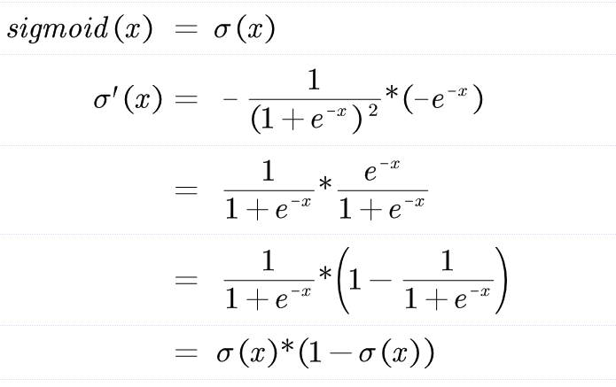
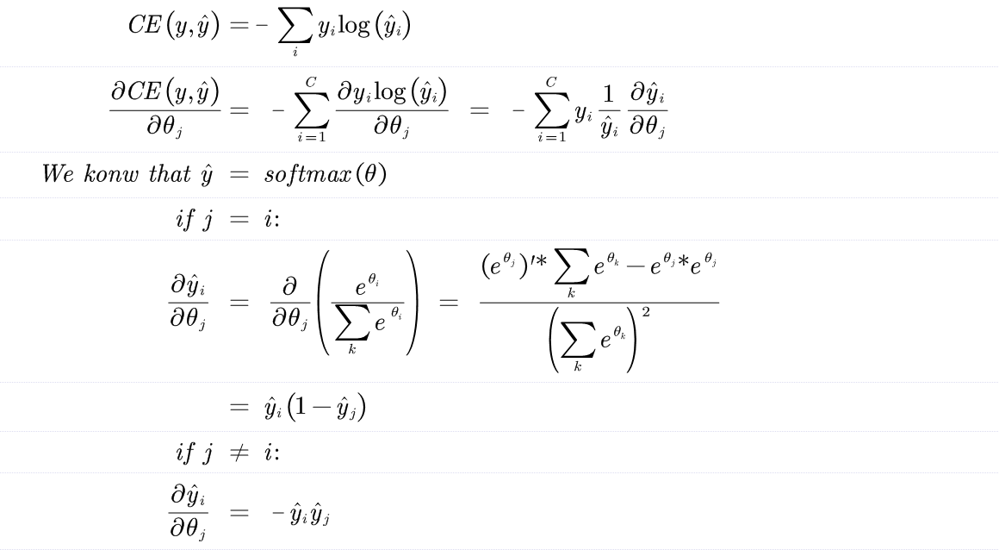
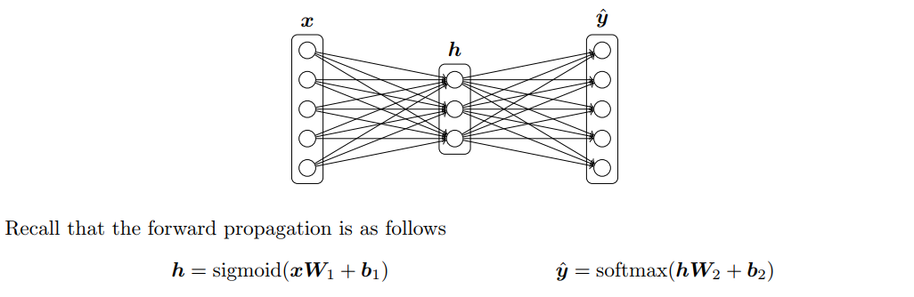

# Neural Network Basics

(a)Derive the gradients of the sigmoid function.

So,the sigmoid function is:

(b)Derive the gradient of the cross entropy function with the softmax fuction.

(c)Derive the gradients with respect to the inputs x to an one-hidden-layer neural network.

(d)How many parameters are there in this neural network, assuming the input is Dx-dimensional,
the output is Dy-dimensional, and there are H hidden units?

Similar to the neural network in c:

The anwser is:
(Dx+1)*H+(H+1)*Dy

(e)Fill in the implementation for the sigmoid activation function and its gradient in *q2 sigmoid.py.*

