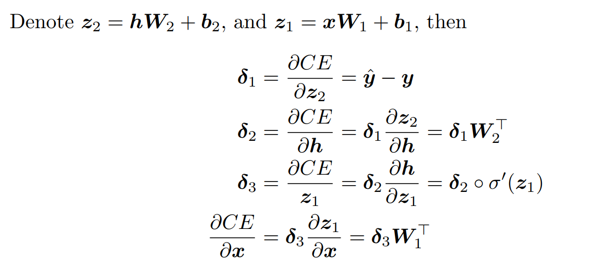

# Neural Network Basics

(a)Derive the gradients of the sigmoid function.

So,the sigmoid function is:


(b)Derive the gradient of the cross entropy function with the softmax fuction.


(c)Derive the gradients with respect to the inputs x to an one-hidden-layer neural network.




(d)How many parameters are there in this neural network, assuming the input is Dx-dimensional,
the output is Dy-dimensional, and there are H hidden units?

Similar to the neural network in c:


The anwser is:
(Dx+1)*H+(H+1)*Dy

(e)Fill in the implementation for the sigmoid activation function and its gradient in *q2 sigmoid.py.*


From the mathematical point of view,The sigmoid function should do it:


```python
def sigmoid(x):
    """
    Arguments:
    x -- A scalar or numpy array.

    Return:
    s -- sigmoid(x)
    """
    s = 1.0/(1+np.exp(-x))
    #raise NotImplementedError
    
    return s
```

And then,my improvement of the gradient for the sigmoid function :


```python
def sigmoid_grad(s):
    """
    Arguments:
    s -- A scalar or numpy array.

    Return:
    ds -- Your computed gradient.
    """

    ds = s*(1.0-s)
    #raise NotImplementedError

    return ds
```

Now you can test iy by calling:
    


```python
import numpy as np
def test_sigmoid_basic():
    """
    Some simple tests to get you started.
    Warning: these are not exhaustive.
    """
    print "Running basic tests..."
    x = np.array([[1, 2], [-1, -2]])
    f = sigmoid(x)
    g = sigmoid_grad(f)
    print f
    f_ans = np.array([
        [0.73105858, 0.88079708],
        [0.26894142, 0.11920292]])
    assert np.allclose(f, f_ans, rtol=1e-05, atol=1e-06)
    print g
    g_ans = np.array([
        [0.19661193, 0.10499359],
        [0.19661193, 0.10499359]])
    assert np.allclose(g, g_ans, rtol=1e-05, atol=1e-06)

test_sigmoid_basic()
```

    Running basic tests...
    [[ 0.73105858  0.88079708]
     [ 0.26894142  0.11920292]]
    [[ 0.19661193  0.10499359]
     [ 0.19661193  0.10499359]]


Now,we use the implemented sigmoid function to create the graph to understand the behavior of this function:


```python
%matplotlib inline
import matplotlib.pyplot as plt

x = np.arange(-10., 10., 0.2)
y = sigmoid(x)
plt.plot(x,y)
plt.show()
```


From the above graph,we can observe that the sigmoid function produces the curve which will be in shape "S",and returns the output value which falls in the range of 0 to 1.
The below are the properties of the Sigmoid function:
- The high value will have the high score but not the higher score.
- Used for binary classification in logistic regression model.
- The probabilities sum need not be 1.

The below is the graph of the gradient of the sigmoid function:


```python
%matplotlib inline
import matplotlib.pyplot as plt

x = np.arange(-10., 10., 0.2)
y = sigmoid_grad(x)
plt.plot(x,y)
plt.show()
```


