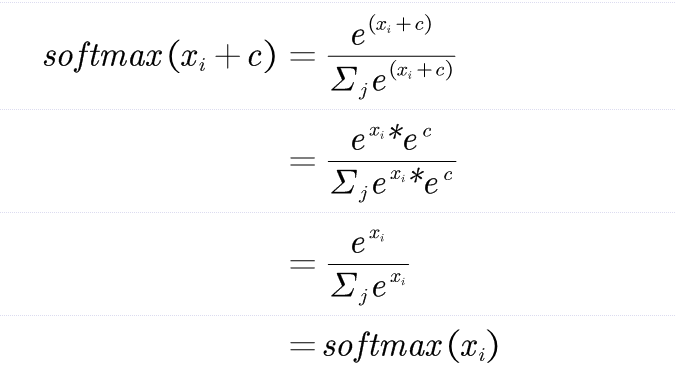
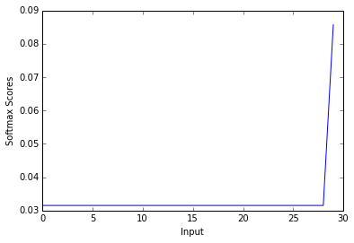

## Softmax

(a) prove that ***softmax*** is invariant to constant offsets in the input,that is, for any input vecotr ***x*** and any constant ***c***,

***softmax(x + c) = softmax(x)***

which ***x+c*** means adding the constant ***c*** to every dimension of ***x***.

First all of,to prove the ***softmax*** function:



(b)Write my implementation in ***q1_softmax.py*** and test it.

From the mathematical point of view,let's try my solution(***Jacksoftmax***):


```python
import numpy as np
def Jacksoftmax(x):
    """Compute the softmax function for each row of the input x.
    Arguments:
    x -- A N dimensional vector or M x N dimensional numpy matrix.
    Return:
    x -- You are allowed to modify x in-place
    """
    orig_shape = x.shape
    if len(x.shape) > 1:
        # Matrix
        max_row = np.max(x, axis=1)
        e_x = np.exp(x - max_row[:,np.newaxis])
        div = np.sum(e_x, axis=1)
        x = e_x/div[:,np.newaxis]
        #raise NotImplementedError
    else:
        # Vector
        x = np.exp((x-x.min())/(x.max()-x.min()))
        sum_column = sum(x)
        for i in range(x.size):
            x[i] = x[i]/float(sum_column)
        #raise NotImplementedError
    assert x.shape == orig_shape
    return x
```

Let's take basic test example:


```python
from sklearn.utils.extmath import softmax

def test_softmax_basic():
    """
    Some simple tests to get you started.
    Warning: these are not exhaustive.
    """
    print "This is the out:"
    test1 = Jacksoftmax(np.array([1,2]))
    print test1
    ans1 = np.array([0.26894142,  0.73105858])
    assert np.allclose(test1, ans1, rtol=1e-05, atol=1e-06)

    test2 = Jacksoftmax(np.array([[1001,1002],[3,4]]))
    print test2
    ans2 = np.array([
        [0.26894142, 0.73105858],
        [0.26894142, 0.73105858]])
    assert np.allclose(test2, ans2, rtol=1e-05, atol=1e-06)

    test3 = Jacksoftmax(np.array([[-1001,-1002]]))
    print test3
    ans3 = np.array([0.73105858, 0.26894142])
    assert np.allclose(test3, ans3, rtol=1e-05, atol=1e-06)
    
test_softmax_basic()
```

    This is the out:
    [ 0.26894142  0.73105858]
    [[ 0.26894142  0.73105858]
     [ 0.26894142  0.73105858]]
    [[ 0.73105858  0.26894142]]


Use this space to test your softmax implementation by running:
        python q1_softmax.py
        


```python
def test_softmax():
    print "Running your tests..."
    print "Enter the dimension of the matrix:"
    n = input()
    m = input()
    test1 = np.random.random((n,m))
    print "The first sample is:"
    print test1
    sk_array1 = softmax(test1)
    print "The answer with softmax of sklearn:"
    print sk_array1
    jk_array1 = Jacksoftmax(test1)
    print "The answer with my softmax:"
    print jk_array1
    assert np.allclose(sk_array1, jk_array1, rtol=1e-05, atol=1e-06)
    test2 = 2.5 * np.random.randn(n,m)+3
    print "The second sample is:"
    print test2
    sk_array2 = softmax(test2)
    print "The answer with softmax of sklearn:"
    print sk_array2
    jk_array2 = Jacksoftmax(test2)
    print "The answer with my softmax:"
    print jk_array2
    assert np.allclose(sk_array2, jk_array2, rtol=1e-05, atol=1e-06)
test_softmax()
```

    Running your tests...
    Enter the dimension of the matrix:
    3
    5
    The first sample is:
    [[ 0.43671419  0.5186239   0.07305987  0.40192912  0.87736423]
     [ 0.562171    0.21029004  0.73408178  0.45466592  0.06376239]
     [ 0.48619156  0.48812272  0.49032508  0.64057408  0.68778803]]
    The answer with softmax of sklearn:
    [[ 0.18867857  0.20478375  0.1311564   0.18222821  0.29315307]
     [ 0.22745343  0.15998252  0.2701173   0.20426955  0.1381772 ]
     [ 0.18530987  0.18566808  0.18607744  0.21624498  0.22669962]]
    The answer with my softmax:
    [[ 0.18867857  0.20478375  0.1311564   0.18222821  0.29315307]
     [ 0.22745343  0.15998252  0.2701173   0.20426955  0.1381772 ]
     [ 0.18530987  0.18566808  0.18607744  0.21624498  0.22669962]]
    The second sample is:
    [[ 1.44076768  4.38050894 -0.67305916  4.04850176  2.21767354]
     [ 6.67231605  0.25089849  0.12486089  1.81697865  0.33540107]
     [-1.15398244  2.64072654  4.48470556  1.07651514  4.25154793]]
    The answer with softmax of sklearn:
    [[ 0.02795269  0.528612    0.00337598  0.37926969  0.06078964]
     [ 0.98754063  0.00160609  0.0014159   0.00768969  0.0017477 ]
     [ 0.00179052  0.07961589  0.50330317  0.01665986  0.39863056]]
    The answer with my softmax:
    [[ 0.02795269  0.528612    0.00337598  0.37926969  0.06078964]
     [ 0.98754063  0.00160609  0.0014159   0.00768969  0.0017477 ]
     [ 0.00179052  0.07961589  0.50330317  0.01665986  0.39863056]]


Follow the result i will get the correct answer by doing vectorization.
Now,We use the implemented softmax function to create the graph to understand the behavior of this function:
- To create a list which contains values in the range of 0 to 10
- Next,pass the list to calculate the scores from the softmax function
- To create a graph.


```python
import matplotlib.pyplot as plt

%matplotlib inline
def softmax_graph(x, y, x_title, y_title):
    plt.plot(x, y)
    plt.xlabel(x_title)
    plt.ylabel(y_title)
    plt.show()


x = np.arange(0,30)
y = Jacksoftmax(x)
print x
print y
softmax_graph(x, y, "Input", "Softmax Scores")
```

    [ 0  1  2  3  4  5  6  7  8  9 10 11 12 13 14 15 16 17 18 19 20 21 22 23 24
     25 26 27 28 29]
    [ 0.03152756  0.03152756  0.03152756  0.03152756  0.03152756  0.03152756
      0.03152756  0.03152756  0.03152756  0.03152756  0.03152756  0.03152756
      0.03152756  0.03152756  0.03152756  0.03152756  0.03152756  0.03152756
      0.03152756  0.03152756  0.03152756  0.03152756  0.03152756  0.03152756
      0.03152756  0.03152756  0.03152756  0.03152756  0.03152756  0.08570079]





The figure shows the property of softmax function:
*** The high value gets the hign score(means probability).***

We can use the softmax function to multi-classification task.
